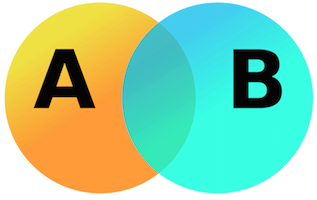

# VCF-comp



A Scala library for analysis of VCF files. Uses [Apache Spark](http://spark.apache.org/), 
[ADAM](https://github.com/bigdatagenomics/adam) and [adam-fx](https://github.com/tmoerman/adam-fx).

## Get the Maven artifact

Artifacts are published to [Bintray](https://bintray.com/tmoerman/maven/vcf-comp).

##### SBT

```sbt
resolvers += "bintray-tmoerman" at "http://dl.bintray.com/tmoerman/maven"`

libraryDependencies += "org.tmoerman" %% "vcf-comp" % "0.1.0"
```

##### Spark Notebook

```
:remote-repo bintray-tmoerman % default % http://dl.bintray.com/tmoerman/maven % maven

:dp org.tmoerman % vcf-comp_2.10 % 0.5.5
```

##### Zeppelin

```
%dep

z.addRepo("bintray-tmoerman").url("http://dl.bintray.com/tmoerman/maven")

z.load("org.tmoerman:vcf-comp_2.10:0.5.5")
```

## Usage

##### Kryo

Vcf-comp uses the adam-fx `KryoRegistrator` that extends the `ADAMKryoRegistrator` with additional Avro data types. Use it
when initializing a `SparkConf`.
      
```scala
val conf = new SparkConf()
    .setAppName("Test")
    .setMaster("local[*]")
    .set("spark.kryo.registrator", "org.tmoerman.adam.fx.serialization.AdamFxKryoRegistrator")
    .set("spark.kryo.referenceTracking", "true")
    .set("spark.serializer", "org.apache.spark.serializer.KryoSerializer")
    
val sc = new SparkContext(conf)
```

##### Starting a VCF comparison

TODO