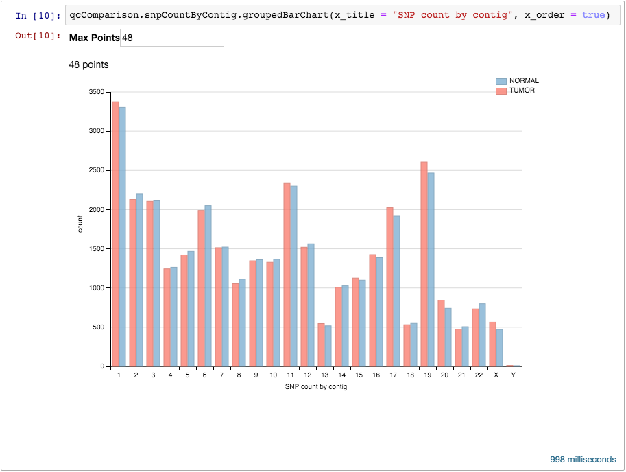
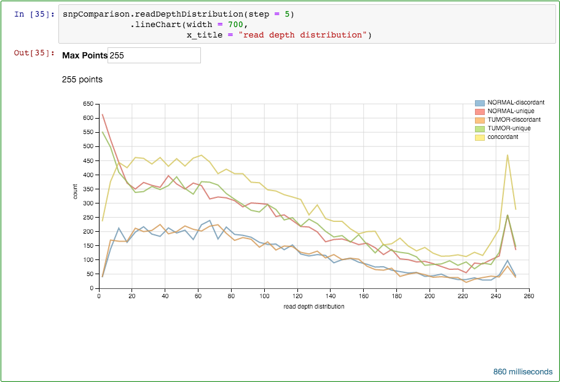

# VCF-comp

VCF-comp is a [Scala](http://www.scala-lang.org/) library for pairwise comparison of annotated [VCF](http://samtools.github.io/hts-specs/VCFv4.2.pdf) files. Uses [Apache Spark](http://spark.apache.org/), [ADAM](https://github.com/bigdatagenomics/adam) and [adam-fx](https://github.com/tmoerman/adam-fx).

VCF-comp is intended for performing VCF analyses using the Scala programming language within a [Spark-notebook](https://github.com/andypetrella/spark-notebook) environment.

VCF-comp is open source software, available on both [Github](https://github.com/tmoerman/vcf-comp) and [BitBucket](https://bitbucket.org/vda-lab/vcf-comp).

VCF-comp artifacts are published to [Bintray](https://bintray.com/tmoerman/maven/vcf-comp). Latest version: `0.3`

--

<!-- TOC depthFrom:1 depthTo:6 withLinks:1 updateOnSave:1 orderedList:0 -->

- [VCF-comp](#vcf-comp)
	- [GETTING STARTED](#getting-started)
		- [Using the Docker image](#using-the-docker-image)
		- [Manual setup](#manual-setup)
			- [Remote artifact repository](#remote-artifact-repository)
			- [Library dependencies](#library-dependencies)
			- [Initialize the SparkContext](#initialize-the-sparkcontext)
			- [Import VCF-comp functionality](#import-vcf-comp-functionality)
			- [Test the setup](#test-the-setup)
	- [USAGE](#usage)
		- [Starting a QC comparison](#starting-a-qc-comparison)
		- [Starting a SNP comparison](#starting-a-snp-comparison)
	- [CONCORDANCE CATEGORIES](#concordance-categories)
	- [OVERVIEW OF ANALYSES](#overview-of-analyses)
		- [QC](#qc)
			- [QC analyses](#qc-analyses)
			- [QC analysis building blocks](#qc-analysis-building-blocks)
		- [SNP comparison](#snp-comparison)
			- [SNP comparison analyses](#snp-comparison-analyses)
			- [SNP comparison building blocks](#snp-comparison-building-blocks)
		- [Visualizations](#visualizations)
	- [HOW IT WORKS](#how-it-works)
		- [Pimp my library](#pimp-my-library)
		- [Dimple.js](#dimplejs)

<!-- /TOC -->

## GETTING STARTED

### Using the Docker image

`TODO`

*(A Docker image containing Spark Notebook and example notebooks with VCF-comp analyses will be available in the near future)*

### Manual setup

We will assume you have a [Spark-notebook](https://github.com/andypetrella/spark-notebook) instance available. If not, have a look at the [launch instructions](https://github.com/andypetrella/spark-notebook#using-a-release).

#### Remote artifact repository

First, we specify the remote Maven [repository](https://bintray.com/tmoerman/maven/vcf-comp) on Bintray from which the VCF-comp library artifact are available.

```
:remote-repo bintray-tmoerman % default % http://dl.bintray.com/tmoerman/maven % maven
```

#### Library dependencies

Next, we specify the library dependencies. We need both the VCF-comp library and the BDGenomics Adam library, but without Hadoop and Spark dependencies, because these are already provided automatically in the Spark Notebook environment.

```
:dp org.tmoerman % vcf-comp_2.10 % 0.3
:dp org.bdgenomics.adam % adam-core % 0.17.1
- org.apache.hadoop % hadoop-client %   _
- org.apache.spark  %     _         %   _
- org.scala-lang    %     _         %   _
- org.scoverage     %     _         %   _
- joda-time         %     _         %   _
```

#### Initialize the SparkContext

We are now ready to configure the running `SparkContext` in the notebook. VCF-comp uses Adam's rich domain classes, therefore we need to define Kryo as the Spark serializer and the Adam-FX Kryo registrator. Don't worry too much about this, just execute the following snippet in a Spark Notebook cell.

```
reset(lastChanges = _.set("spark.app.name", "My VCF analysis")
                     .set("spark.serializer", "org.apache.spark.serializer.KryoSerializer")
                     .set("spark.kryo.registrator", "org.tmoerman.adam.fx.serialization.AdamFxKryoRegistrator")
                     .set("spark.kryoserializer.buffer", "32m")
                     .set("spark.kryoserializer.buffer.max value", "128")
                     .set("spark.kryo.referenceTracking", "true"))
```

#### Import VCF-comp functionality

Almost there! The final setup step is to import the necessary VCF-comp classes and functions.

```
import org.tmoerman.vcf.comp.VcfComparisonContext._
import org.tmoerman.vcf.comp.core.Model._
import org.tmoerman.vcf.comp.viz.SparkNoteBookDimpleGraphs._

import org.tmoerman.adam.fx.avro.AnnotatedGenotype

implicit def toDimpleChart(chart: DimpleChart) = chart match {
  case DimpleChart(data, js, s) => DiyChart(data, js, maxPoints = chart.maxPoints, sizes = s)
}
```

#### Test the setup

We can now test the setup of the library by executing the `.help` function on the SparkContext variable (`sc` or `sparkContext`).

```
sc.help
```

This method should return a list of methods we can invoke on the SparkContext:

```
res9: String =
- getMetaFields
- startQcComparison
- startSnpComparison
```

This is VCF-comp's so-called *discoverable API* in action. We discuss this concept in more detail later.

Well done! We are now ready to perform an actual pairwise VCF comparison analysis! Read on to find out how.

## USAGE

Some proficiency in [Scala](http://www.scala-lang.org/) is expected. Don't worry, the level of Scala programming required to effectively use this library is quite basic. If you have some experience with Java, Python, C++ or C#, most of the code in this tutorial will feel very familiar.

The motivation for adopting a programmatic Notebook approach in this tool is because this is essentially a *data science* tool. Data science tools ideally show exactly how an analysis has been performed, by making the individual steps explicit as code. Although the threshold to get started is higher than a point-and-click interface, this disadvantage is outweighed in the long run by the benefits of the reproducible nature of a notebook approach.

VCF-comp focuses on pairwise comparison of VCF files, so let's get two interesting files ready: `tumor.vcf` and `normal.vcf`. In this example, we read these files from [HDFS](https://hadoop.apache.org/docs/r1.2.1/hdfs_design.html):

```Scala
val workDir = "hdfs://bla:54310/my-data/VCF/"

val tumor  = workDir + "tumor.vcf"
val normal = workDir + "normal.vcf"
```

We can now start two types of VCF comparison: a quality control (QC) comparison and a SNP comparison. Let's start with a QC comparison.

### Starting a QC comparison

To start a QC comparison, we invoke the appropriate method on the SparkContext instance `sc`. Remember, as previously mentioned, we can always invoke the `.help` method on different objects in the analysis, to give us a list of methods available at that point. Let's do that one more time:

```Scala
sc.help
```
```
res9: String =
- getMetaFields
- startQcComparison
- startSnpComparison
```

The method `startQcComparison` is the one we need, let's invoke it while setting some parameters:

```
val qcParams = new ComparisonParams(labels = ("TUMOR", "NORMAL")) // parameters

val qcComparison = sc.startQcComparison(tumor, normal, qcParams) // a Spark RDD
                     .cache()                                    // cache the RDD
```

The `ComparisonParams` object defines labels for our VCF files. The result of invoking `startQcComparison` is a Spark [RDD](http://spark.apache.org/docs/latest/programming-guide.html#resilient-distributed-datasets-rdds), which we cache in memory because it is an intermediate result we will use in future computations. We store this RDD in a value named `qcComparison`.

Let's once again use the `.help` method to discover how we can proceed. This time we don't invoke it on the SparkContext `sc`, but on the `qcComparison` value.

```Scala
qcComparison.help
```
```
res11: String =
- countByProjection
- countByTraversableProjection
- indelLengthDistribution
- snpCountByContig
- snpQualityDistribution
- snpReadDepthDistribution
- variantTypeCount
```

Looks like we can do some interesting analyses! Let's have a look at the number of SNPs we can find in the different contigs, so we choose `snpCountByContig`.

```Scala
qcComparison.snpCountByContig
```

Oops, now we get some gobbledigook:

```
res16: Iterable[org.tmoerman.vcf.comp.core.Model.QcProjectionCount[String]] = List(QcProjectionCount(NORMAL,9,1361),
QcProjectionCount(NORMAL,1,3304), QcProjectionCount(TUMOR,20,844), QcProjectionCount(NORMAL,12,1564),
QcProjectionCount(TUMOR,19,2607), QcProjectionCount(TUMOR,21,476), QcProjectionCount(TUMOR,1,3376),
QcProjectionCount(TUMOR,13,547), QcProjectionCount(TUMOR,Y,12), QcProjectionCount(NORMAL,11,2300),
QcProjectionCount(TUMOR,22,733), QcProjectionCount(NORMAL,2,2197), QcProjectionCount(TUMOR,12,1520),
QcProjectionCount(NORMAL,7,1522), QcProjectionCount(NORMAL,16,1387), QcProjectionCount(NORMAL,18,54...
```

That doesn't look right, we'd prefer to see some graphical output. Let's consult the `.help` function once more, this time we invoke it on the result of the `qcComparison.snpCountByContig` calculation:

```Scala
qcComparison.snpCountByContig.help
```
```
res17: String =
- groupedBarChart
- lineChart
```

Okay, a histogram is probably the most sensible chart for a SNP count by contig, so let's choose that one:

```Scala
qcComparison.snpCountByContig
            .groupedBarChart(x_title = "SNP count by contig",
                             x_order = true)
```

We also specified some overriding attributes of the grouped bar chart. The result is an object that is automagically turned into a chart by the notebook.



Nice!

This sequence of steps illustrates the primary usage pattern of the VCF-comp library. See section [QC analyses](#) for an overview of QC functionality.

Let's now apply this for a SNP comparison.

### Starting a SNP comparison

Analogously, we launch a SNP comparison.

```Scala
val snpParams = new ComparisonParams(labels = ("TUMOR", "NORMAL"))

val snpComparison = sc.startSnpComparison(tumor, normal, snpParams) // a Spark RDD
                      .cache()                                      // cache the RDD		
```

In the same spirit as the QC example, we create a Spark RDD instance by invoking the `startSnpComparison` function on the SparkContext `sc`. Analogously, we can inspect the list of available functions by invoking the `.help` function on the `snpComparison` value.

```Scala
snpComparison.help
```
```
res17: String =
- alleleFrequencyDistribution
- allelesSwitchCount
- baseChangeCount
- baseChangePatternCount
- baseChangeTypeCount
- categoryCount
- clinvarRatio
- commonSnpRatio
- countByProjection
- countBySwitch
- countByTraversableProjection
- functionalAnnotationCount
- functionalImpactCount
- qualityDistribution
- readDepthDistribution
- synonymousRatio
- transcriptBiotypeCount
- viewOnly
- zygosityCount
- zygositySwitchCount
```

Let's choose the `readDepthDistribution` analysis, and inspect which visualizations are available. Note that not all visualization make sense for a "distribution" type analysis.

```Scala
snpComparison.readDepthDistribution().help
```
```
res21: String =
- groupedBarChart
- lineChart
- lollipopPieChart
- percentageBarChart
- stackedBarChart
- table
```

In this case, a line chart makes most sense, so let's try that.

```Scala
snpComparison.readDepthDistribution(step = 5)
             .lineChart(width = 700,
                        x_title = "read depth distribution")
```



Sweet!

Notice that again, we have overridden some of the default arguments in both the `readDepthDistribution` as well as the `lineChart` methods. Check the documentation for more information about which arguments are available on the analysis methods.

This concludes two examples of how to launch a QC comparison and a SNP comparison. The next section deals with the core concept of the SNP comparison functionality: the 5 concordance categories.

## CONCORDANCE CATEGORIES

The heart of VCF-comp is an algorithm that matches variants per position by concordance. By concordance, we mean a degree to which both files agree about the variants or their genotypes on that position, according to a configurable matching criterion. VCF-comp defines 5 categories:

name              | meaning          
----------------- | ---
`A-unique`        | File A has a variant on this position, file B does not                                  
`B-unique`        | File B has a variant on this position, file A does not                                  
`Concordant`      | Both file A and B have the same variant on this position with respect <br/> to the matching criterion. A concordant variant is counted once.
`A-discordant`    | File A and B have a variant on this position, but do not agree with <br/> respect to the matching criterion. This variant is the one from file A.
`B-discordant`    | File A and B have a variant on this position, but do not agree with <br/> respect to the matching criterion. This variant is the one from file B.

The default matching criterion is: matching **genotype alleles** in both files A and B.

In our opinion, this is the most sensible default behaviour. However, a researcher might want to define a different matching criterion. This is possible. The `ComparisonParams` class defines the default behaviour, but this is overridable, as illustrated in following example:

```Scala
val snpParamsAA = new ComparisonParams(
  labels = ("TUMOR", "NORMAL"),
  matchFunction = (gt: AnnotatedGenotype) => gt.getGenotype.getVariant.getAlternateAllele) // overridden match function

val snpComparisonAA = sc.startSnpComparison(tumor, normal, snpParamsAA)
                        .cache()
```

The `matchFunction` is the function used in the matching algorithm to determine concordance. The matchFunction can return anything, or in Scala jargon: the function has the `Any` return type. If file A and B have a variant on a position, this function is applied on the corresponding genotypes and the results are compared for equality. If the results are equal we have a concordant variant, if they are not equal we have two discordant variants.

Here we have overridden it with a function that takes an `AnnotatedGenotype` and returns the alternate allele of the variant associated with the genotype. This is a less strict matching criterion than the default one, and could be useful for a particular analysis.

Note that overriding the `matchFunction` only affects the balance between concordant and discordant variants. The unique variants remain stable.

## OVERVIEW OF ANALYSES

This section contains an overview of all available analyses. Additionally, the [higher-order](https://en.wikipedia.org/wiki/Higher-order_function) functions that act as building blocks for the available analyses and ad-hoc analyses are discussed. Using the building block functions requires a more advanced mastery of the Scala language.

`TODO` *(Scala docs will be hosted on a dedicated site in the near future.)*

### QC

#### QC analyses

```Scala
def variantTypeCount
```

```Scala
def snpCountByContig
```

```Scala
snpReadDepthDistribution(step: Int = DEFAULT_READ_DEPTH_STEP)
```

```Scala
def snpQualityDistribution(step: Double = DEFAULT_QUALITY_STEP)
```

```Scala
def indelLengthDistribution
```

#### QC analysis building blocks

```Scala
def countByProjection[P: ClassTag](projection: VariantContext => P): Iterable[QcProjectionCount[P]]
```

```Scala
def countByTraversableProjection[P: ClassTag](projection: VariantContext => Traversable[P]): Iterable[QcProjectionCount[P]]
```

### SNP comparison

#### SNP comparison analyses


```Scala
/**
  * @param occurrences vararg. Accepts one or more Strings from "unique", "concordant", "discordant".
  *
  * @return Returns the RDD, filtered on the specified occurrences.
  */
def viewOnly(occurrences: String*)
```

```Scala
/**
  * @return Returns SNP count by concordance category.
  */
def categoryCount
```

```Scala
/**
  * @return Returns SNP count by base change per concordance category.
  *
  *         Base change is a String: "ref->alt" where ref and alt are the variant alleles, e.g. "A->T", "G->C", etc...
  */
def baseChangeCount
```

```Scala
/**
  * @return Returns SNP count by base change pattern per concordance category.
  *
  *         Base change pattern is a String: "ref:alt", analogous to base change, but without taking into account
  *         the order of ref to alt, e.g. "A:T", "C:G", etc...
  */
def baseChangePatternCount
```

```Scala
/**
  * @return Returns SNP count by base change type per concordance category.
  *
  *         Base change types are "Ti" (Transition) and "Tv" (Transversion).
  */
def baseChangeTypeCount
```

```Scala
/**
  * @return Returns SNP count by zygosity per concordance category.
  *
  *         Zygosity values are: "HOM_REF", "HET", "HOM_ALT", "NO_CALL".
  */
def zygosityCount
```

```Scala
/**
  * @return Returns SNP count by functional impact per concordance category.
  *
  *         Functional impact is a scale value provided by SnpEff: "HIGH", "MODERATE", "LOW" and "MODIFIER".
  *
  *         Cfr. SnpEff http://snpeff.sourceforge.net/VCFannotationformat_v1.0.pdf
  */
def functionalImpactCount
```

```Scala
/**
  * @return Returns SNP count by functional annotation per concordance category.
  *
  *         Functional annotation is a SnpEff annotation, including: "synonymous_variant", "missense_variant",
  *         "stop_gained", "start_lost".
  *
  *         Assumes annotation with SnpEff http://snpeff.sourceforge.net/VCFannotationformat_v1.0.pdf
  */
def functionalAnnotationCount
```

```Scala
/**
  * @return Returns SNP count by transcript biotype per concordance category.
  *
  *         Transcript biotype is a SnpEff annotation: including: "protein_coding", "retained_intron"
  *         "nonsense_mediated_decay".
  *
  *         Assumes annotation with SnpEff http://snpeff.sourceforge.net/VCFannotationformat_v1.0.pdf
  */
def transcriptBiotypeCount
```

```Scala
/**
  * @param label (optional). Maps the Boolean to a descriptive label.
  *
  * @return Returns the ratio of SNPs with a Clinvar annotation vs. SNPs without.
  *
  *         Assumes VCF annotation with SnpSift http://snpeff.sourceforge.net/SnpSift.html
  */
def clinvarRatio(label: Boolean => String)
```

```Scala
/**
  * @param label (optional). Maps the Boolean to a descriptive label.
  *
  * @return Returns the ratio of SNPs with a DbSNP annotation vs. SNPs without.
  *
  *         Assumes VCF annotation with SnpSift http://snpeff.sourceforge.net/SnpSift.html
  */
def commonSnpRatio(label: Boolean => String)
```

```Scala
/**
  * @param label (optional). Maps the boolean to a descriptive label.
  *
  * @return Returns the ratio of SNPs with "synonymous_variant" vs. "missense_variant" annotation. If a SNP has
  *         neither annotation, it is not taken into account.
  *
  *         Assumes annotation with SnpEff http://snpeff.sourceforge.net/VCFannotationformat_v1.0.pdf
  */
def synonymousRatio(label: Boolean => String)
```

```Scala
/**
  * @param step (optional). Size of the step interval for binning the read depth values.
  *
  * @return Returns the distribution of SNPs by read depth.
  */
def readDepthDistribution(step: Int = DEFAULT_READ_DEPTH_STEP)
```  

```Scala
/**
  * @param step (optional). Size of the step interval for binning the quality values.
  *
  * @return Returns the distribution of SNPs by quality.
  */
def qualityDistribution(step: Double = DEFAULT_QUALITY_STEP)
```

```Scala
/**
  * @param step (optional). Size of the step interval for binning the allele frequency values.
  *
  * @return Returns the distribution of SNPs by allele frequency.
  */
def alleleFrequencyDistribution(step: Double = DEFAULT_ALLELE_FREQUENCY_STEP)
```

```Scala
def zygositySwitchCount
```

```Scala
def allelesSwitchCount
```

#### SNP comparison building blocks

```Scala
def countByProjection[P](projection: AnnotatedGenotype => P): Iterable[CategoryProjectionCount[P]]
```

```Scala
def countByTraversableProjection[P](projection: AnnotatedGenotype => Traversable[P]): Iterable[CategoryProjectionCount[P]]
```

```Scala  
def countBySwitch[P](projection: AnnotatedGenotype => Option[P]): Iterable[CategoryProjectionCount[String]]
```

### Visualizations

`TODO`

## HOW IT WORKS

### Pimp my library

VCF-comp makes use of a Scala idiom called [*"Pimp my library"*](http://www.artima.com/weblogs/viewpost.jsp?thread=179766), through Scala's implicit conversions.

`TODO`

### Dimple.js

`TODO`

http://snpeff.sourceforge.net/VCFannotationformat_v1.0.pdf
